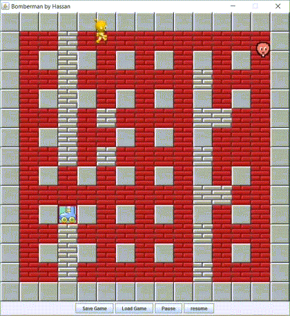

#### About
Bomberman arcade game written in Java using swing toolkit, as an assignment for Advanced Programming CS:300 Spring 2012-13, a course I look in my 2nd year of B.S. at LUMS.

#### Screenshots
Powerup:
![alt text][Image 1]
 
Death:
![alt text][Image 2]

#### Gifs

<!--  -->

[Image 1]: readme_assets/1.png "Power Up"
[Image 2]: readme_assets/2.png "Death"

#### Youtube

